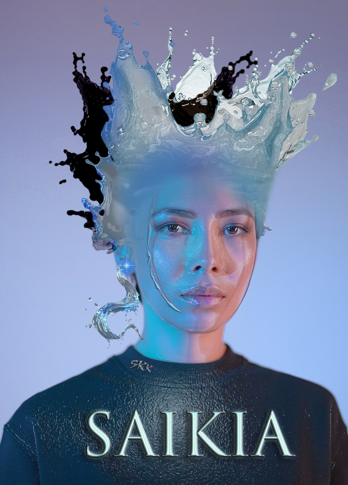
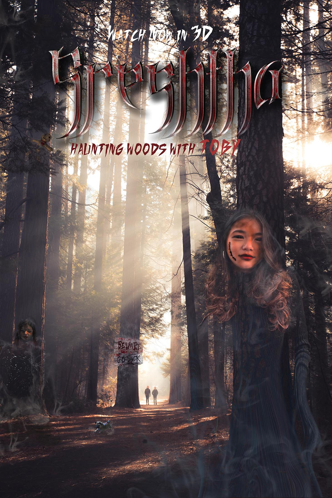
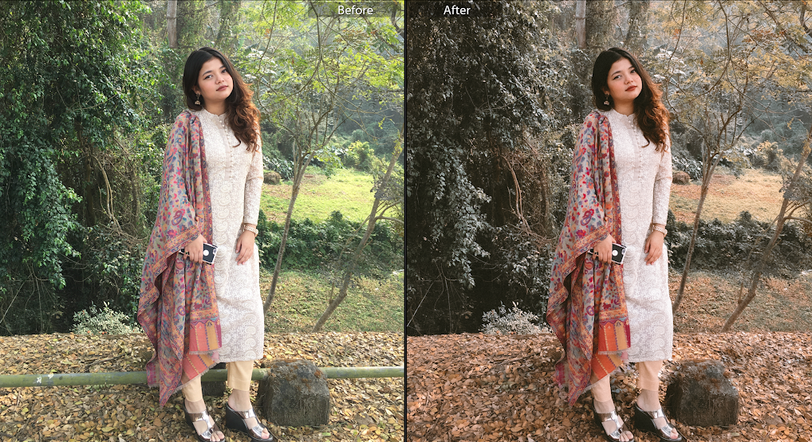
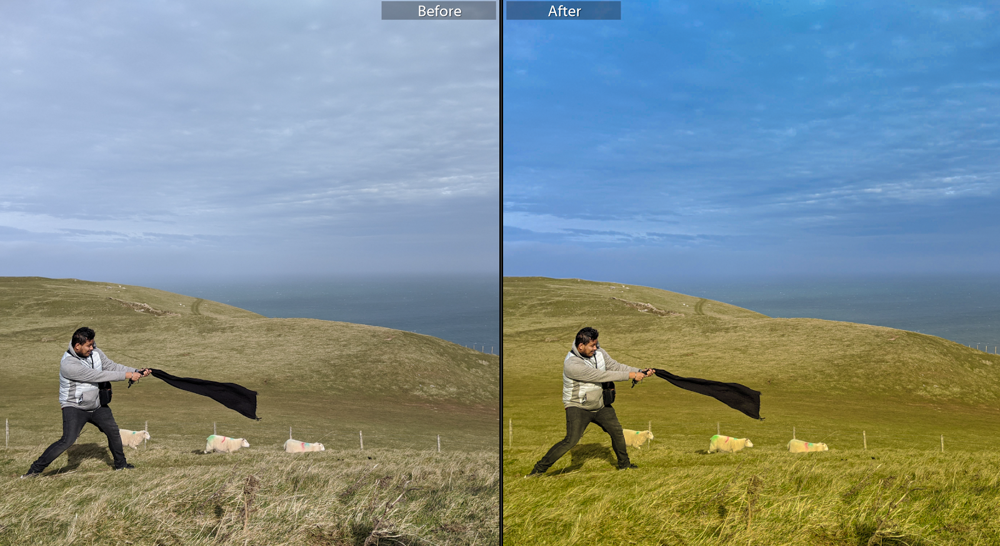
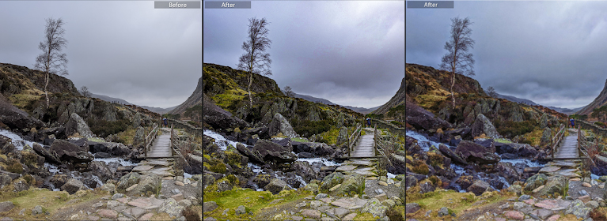

# Design works and notes
In this repository I keep track of my design works and notes on best practices. I do sketch, photography and design work as a hobbyist in my free time.

### Design work on <b>Image & Audio Media</b>

#### 🧵 <b>Adobe Photoshop</b> <a>

#### 🧵 <b>Adobe Photoshop</b> <a>

### Design work on <b>Video Media</b>

