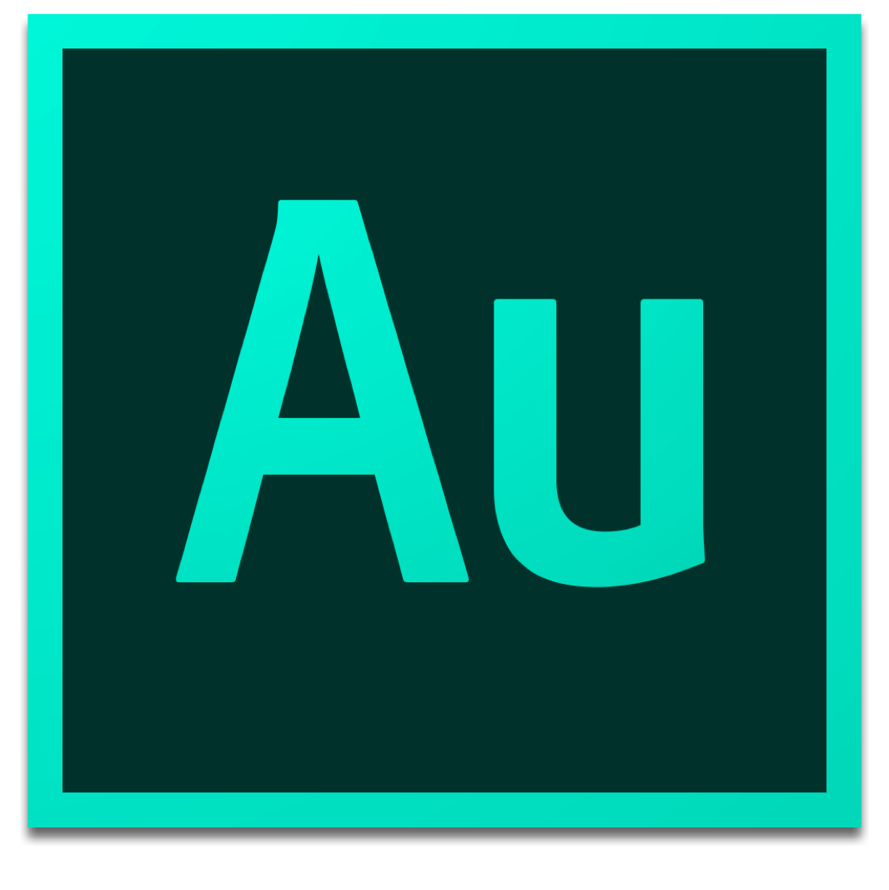
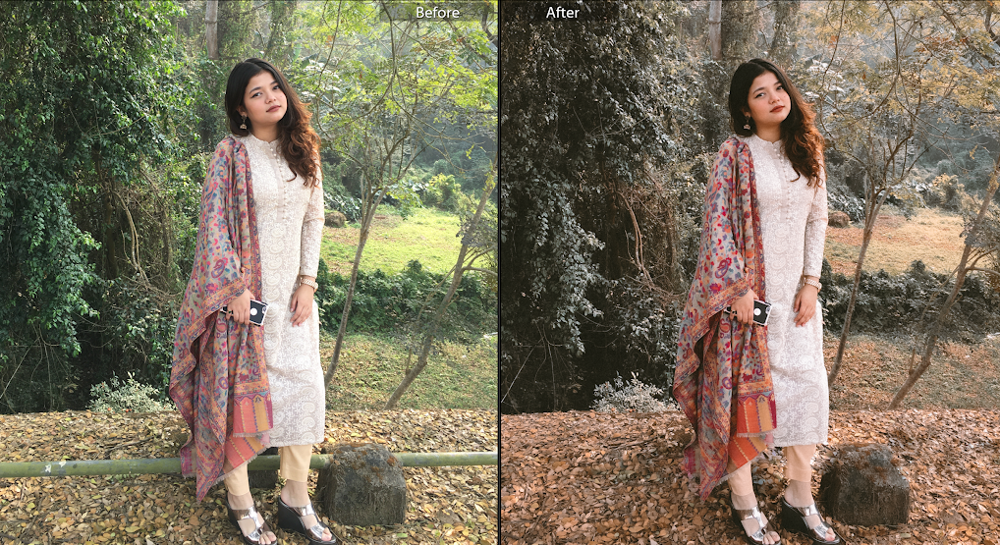
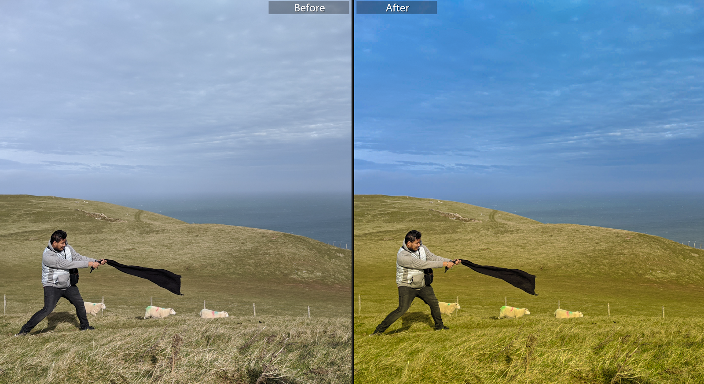
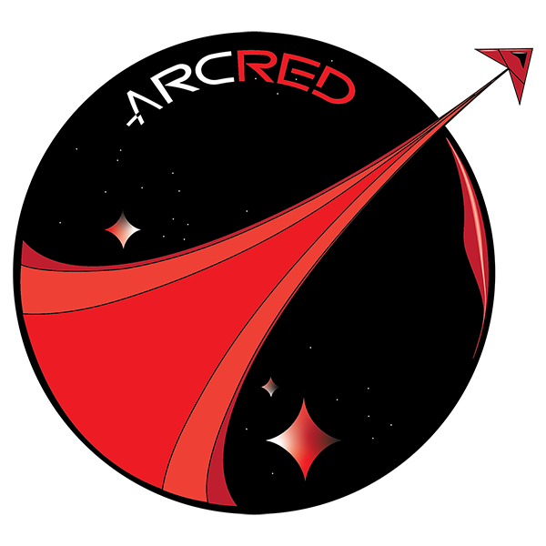
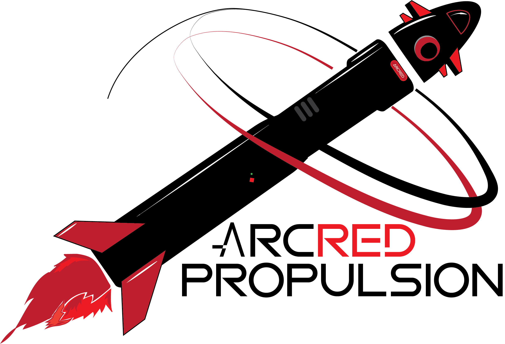
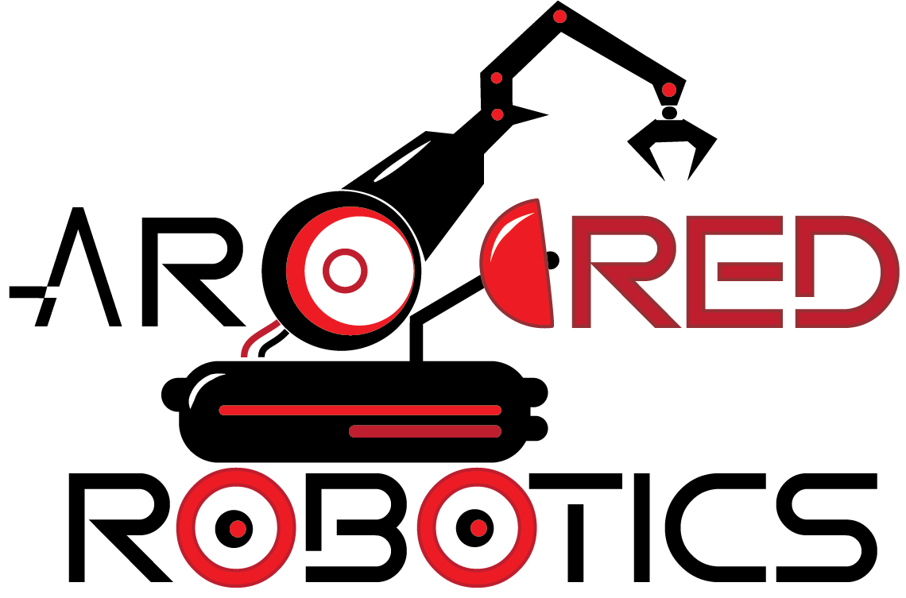
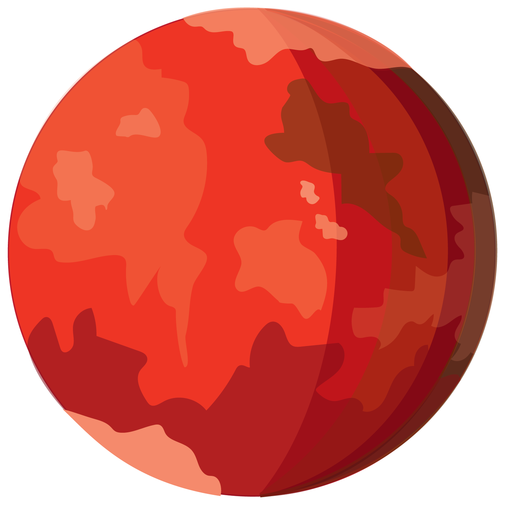
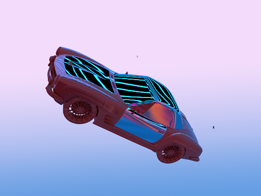
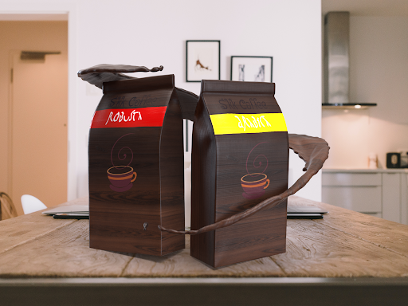

# Design works and notes : De-si9
In this repository I keep track of my design works and notes on best practices. I do sketch, photography and design work as a hobbyist in my free time.

### Design work on <b>Image & Audio Media</b>

#### 🧵 <b>Adobe Photoshop</b> <a> [[NOTES]](./notes/ps.md)

#### 🧵 <b>Adobe Lightroom</b> <a>

#### 🧵 <b>Adobe Illustrator</b> <a>

#### 🧵 <b>Adobe Dimension</b> <a>

#### 🧵 <b>Adobe XD</b> <a>

#### 🧵 <b>Adobe Audition</b> <a>

#### 🧵 <b>Adobe Animate</b> <a>

#### 🧵 <b>Toon Boom</b> <a>

### Design work on <b>Video Media</b>

#### 🧵 <b>Adobe Premiere Pro</b> <a>

<a href="https://youtu.be/p9mai4g1hw8">

#### 🧵 <b>Adobe After Effects</b> <a>

#### 🧵 <b>Blender</b> <a>

#### 🧵 <b>Autodesk Maya and Arnold</b>  & <a>

#### 🧵 <b>SideFX Houdini</b> <a>

#### 🧵 <b>Cinema 4D</b> <a>
